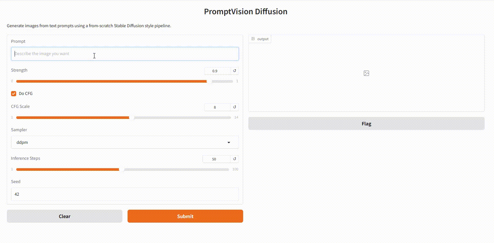
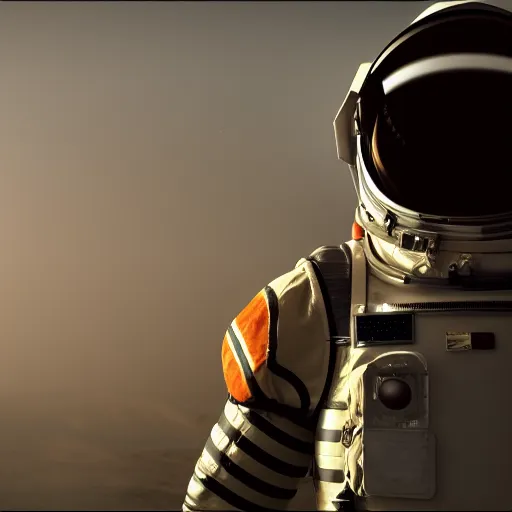
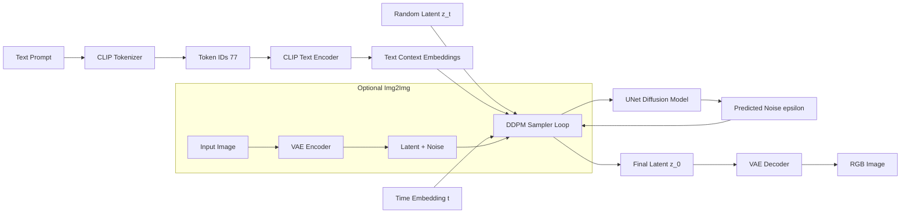

# PromptVision Diffusion

[](#quickstart)
[](#quickstart)
[](LICENSE)

PromptVision Diffusion is a from-scratch Stable Diffusion style implementation in PyTorch with a clear educational codebase and a runnable Gradio app. It is designed for two audiences:

- Engineers who want to understand diffusion internals end-to-end.
- Recruiters and collaborators who want a portfolio project with strong technical depth and reproducibility.

## Demo Preview

Add a short 5 to 10 second generation GIF at `assets/showcase/hero-demo.gif`.



Suggested GIF flow:

1. Prompt appears on screen.
2. Denoising progress snapshots (early, mid, final).
3. Final output with settings (`seed`, `cfg_scale`, `steps`).

## Highlights

- End-to-end text-to-image pipeline: CLIP text encoder, UNet denoiser, VAE decoder, DDPM sampler.
- Deterministic generation via `seed` and configurable `cfg_scale`, `strength`, and inference steps.
- Local-first workflow with `venv`, test scripts, and a clean repository layout.
- Checkpoint conversion path from standard Stable Diffusion v1.5 weights.

## Repository Layout

```text
assets/
	showcase/                 # README gallery images
data/                       # tokenizer files + model checkpoint
images/                     # optional image-to-image input assets
notebooks/
	stable_diffusion.ipynb
scripts/
	clean.ps1
	self-test.ps1
sd/
	app.py                    # Gradio app entrypoint
	attention.py
	clip.py
	ddpm.py
	decoder.py
	diffusion.py
	encoder.py
	model_converter.py
	model_loader.py
	pipeline.py
tests/
	test_ddpm_sampler.py
	test_pipeline_utils.py
```

## Quickstart

### 1. Create and activate virtual environment

```bash
python -m venv .venv
# Windows (PowerShell)
.\.venv\Scripts\Activate.ps1
# Windows (Command Prompt)
# .venv\Scripts\activate.bat
# macOS/Linux
# source .venv/bin/activate
```

### 2. Install dependencies

```bash
python -m pip install --upgrade pip
python -m pip install -r requirements.txt
```

### 3. Download model checkpoint

Place this file in `data/`:

- `v1-5-pruned-emaonly.ckpt`
- Source: `https://huggingface.co/LarryAIDraw/v1-5-pruned-emaonly/resolve/main/v1-5-pruned-emaonly.ckpt`

### 4. Run the app

```bash
python sd/app.py
```

Open the local URL printed in terminal (`http://127.0.0.1:786x`).

## Quick Repro Run

For consistent portfolio outputs, start with this exact setting profile:

- `prompt`: choose one from the Showcase section.
- `sampler_name`: `ddpm`
- `n_inference_steps`: `50`
- `cfg_scale`: `8`
- `seed`: `42`

## Showcase Prompts

Use these exact prompts for your portfolio gallery.

Recommended baseline settings:

- `sampler_name`: `ddpm`
- `n_inference_steps`: `50`
- `cfg_scale`: `8`
- `seed`: `42`

### 1. Cinematic Character

`a cinematic portrait of a tiger astronaut in a detailed space suit, rim lighting, volumetric fog, ultra detailed, sharp focus, 8k`



### 2. Atmosphere and Lighting

`a neon-lit rainy cyberpunk street in tokyo at night, reflections on wet asphalt, people with umbrellas, depth of field, highly detailed concept art`


### 3. Composition and Detail

`an ancient mountain temple at golden hour, dramatic clouds, god rays, intricate stone carvings, wide angle composition, photorealistic, high detail`


## Evaluation Snapshot

Use this table to document reproducible outcomes for your top prompts.

| Prompt ID | Prompt Theme | Seed | Steps | CFG | Device | Runtime (s) | Output |
|---|---|---:|---:|---:|---|---:|---|
| P1 | Cinematic Character | 42 | 50 | 8.0 | CUDA | 305.24 | `assets/showcase/prompt-1-cinematic-tiger-astronaut.png` |
| P2 | Atmosphere and Lighting | 42 | 50 | 8.0 | CUDA | 302.78 | `assets/showcase/prompt-2-neon-rainy-street.png` |
| P3 | Composition and Detail | 42 | 50 | 8.0 | CUDA | 284.89 | `assets/showcase/prompt-3-golden-hour-temple.png` |

## Performance Benchmark (RTX 4060)

Update this table after running your own measurements.

| Resolution | Steps | CFG | Seed | Avg Runtime (s) | Notes |
|---|---:|---:|---:|---:|---|
| 512x512 | 20 | 8.0 | 42 | 126.62 | Fast preview mode |
| 512x512 | 30 | 8.0 | 42 | 184.66 | Balanced quality/speed |
| 512x512 | 50 | 8.0 | 42 | 304.74 | Showcase quality mode |

## Architecture Diagram (Mermaid)



## Inference Controls

- `prompt`: text prompt for generation.
- `strength`: img2img noise strength.
- `cfg_scale`: classifier-free guidance scale.
- `sampler_name`: currently `ddpm`.
- `n_inference_steps`: denoising iterations.
- `seed`: deterministic reproducibility.

## Validation and Quality

Run tests:

```bash
python -m pytest -q
```

Windows helper scripts:

```powershell
# Full environment + test flow
.\scripts\self-test.ps1

# Skip install if deps already exist
.\scripts\self-test.ps1 -SkipInstall

# Remove generated temp folders
.\scripts\clean.ps1
```

## Troubleshooting

### `FileNotFoundError` for checkpoint

- Ensure `data/v1-5-pruned-emaonly.ckpt` exists.
- If you use a different checkpoint name, keep only one `.ckpt` in `data/`.

### `CLIPTokenizer has no attribute batch_encode_plus`

- Caused by tokenizer API changes in recent `transformers`.
- Fixed in current code by using modern tokenizer calls.

### Poor image quality or prompt not followed

- Ensure tokenizer loads full vocab (`~49408`) from local `data/`.
- Use `steps >= 50` and `cfg_scale` around `7.5` to `9.0`.
- Keep prompt style specific (subject, lighting, lens/composition descriptors).

### `No module named pytorch_lightning`

- Install dependencies from `requirements.txt`.
- If needed, run: `python -m pip install pytorch-lightning`.

## Roadmap

- Add advanced samplers (`pndm`, `lms`, `heun`).
- Add benchmark table for prompt fidelity vs generation time.
- Add negative prompt support in UI.
- Add structured CLI entrypoint and package layout.

## Release Plan

Target first flagship release: `v1.0.0`.

Release checklist:

1. Add final showcase images and hero GIF.
2. Fill Evaluation and Benchmark tables with real measurements.
3. Tag release and publish notes from `CHANGELOG.md`.
4. Pin repository on GitHub profile.

## Legacy Notes

Legacy screenshots and historical notes are in `docs/legacy-text-to-text-readme.md`.

## Contributing

Contributions are welcome. See `CONTRIBUTING.md`.

## License

MIT License. See `LICENSE`.
